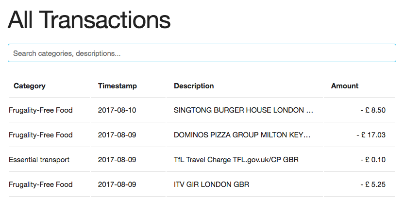

# Elm Table
#### A sortable, searchable table using Elm.

#### _Try it out [here](http://elm-table.s3-website.eu-west-2.amazonaws.com/)!_

[Elm](http://elm-lang.org/) is a programming language which compiles to HTML and JavaScript.
Elm's advantages include an intuitive functional reactive programming style, a no-runtime-error guarantee,
and a time-travelling debugger.

This application:
* Loads transactions from a JSON endpoint;
* Transforms these transactions into Elm native data types; and
* Displays these transactions in a sortable, searchable table

By default, the data is sorted by timestamp. Although the table only displays
dates, the data itself contains (and is sorted by) ISO timestamps.

Click a heading once to sort by the corresponding attribute. Click again to reverse the order.

Type in the box to search the table. Your search query can either match the
category or the description of a transaction.

[Skeleton](http://getskeleton.com) and [Normalize](https://necolas.github.io/normalize.css/) are
both used for the app's interface.
